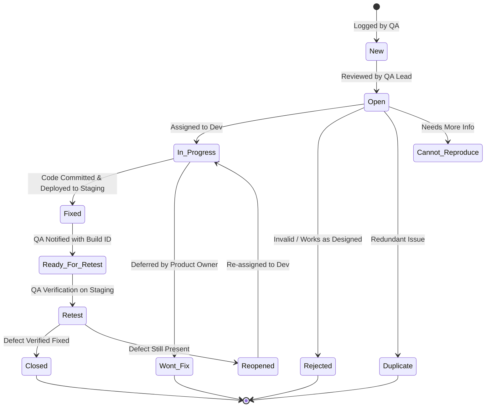

# Defect Management & Escalation Process

## 1. Objective & Scope
The objective of this Defect Management Process is to establish a rigorous, transparent, and reproducible methodology for identifying, logging, prioritizing, verifying, and closing defects across the software testing life cycle (STLC) for nopCommerce v4.70.

This process applies to all test levels: Functional Manual, Automated Regression, API Testing, Performance Testing, Accessibility, and Database Testing.

---

## 2. Defect Lifecycle State Machine



### State Definitions
1. **New / Logged:** Bug discovered and logged into Jira by QA with full reproduction steps.
2. **Open / Triaged:** Reviewed during daily triage; verified as valid and prioritized.
3. **In Progress:** Developer actively investigating or implementing code fix.
4. **Fixed:** Fix committed, unit tested, merged to development branch, and deployed to Staging build.
5. **Ready for Retest:** Release notes indicate specific build tag containing the fix.
6. **Retest:** QA validates fix against exact reproduction steps, regression test cases, and edge cases.
7. **Closed:** Defect resolved without side-effects. Verification screenshots/logs attached.
8. **Reopened:** Defect reproduced on new build. Root cause feedback added.
9. **Rejected / Cannot Reproduce / Duplicate:** Closed following triage consensus.

---

## 3. Severity & Priority Classification Matrix

### Severity Definitions (Technical & System Impact)
- **S1 — Blocker / Critical:** System crash, fatal data corruption, security vulnerability, core business path blocked with no workaround (e.g., checkout failure, unhandled 500 error, password reset flaw).
- **S2 — Major:** Significant feature broken or major business rule violated, but an unintuitive workaround exists (e.g., filtering fails, guest order address orphan).
- **S3 — Medium:** Minor functional defect, non-blocking UI/UX flaw, localized error message inaccuracy, or layout glitch that does not prevent task completion.
- **S4 — Low / Trivial:** Typographical error, cosmetic alignment, minor styling difference across browsers.

### Priority Definitions (Business Urgency & Resolution SLA)
- **P1 — Urgent (Resolve within 4 hours):** Blocks ongoing testing or immediate release; top-priority hotfix.
- **P2 — High (Resolve within 24 hours):** Must be fixed prior to Release Candidate sign-off.
- **P3 — Medium (Resolve within current Sprint):** Planned for normal sprint backlog.
- **P4 — Low (Backlog):** Scheduled for future release or maintenance window.

### Severity vs. Priority Mapping Matrix
| Severity \ Priority | P1 (Urgent) | P2 (High) | P3 (Medium) | P4 (Low) |
| :--- | :---: | :---: | :---: | :---: |
| **S1 (Blocker)** | Core checkout flow fails | Admin bulk export 500 error | Feature flag disabled | — |
| **S2 (Major)** | Broken promo code on holiday | Wishlist item removal delay | Cart item count badge sync | — |
| **S3 (Medium)** | — | Incorrect date format on invoice | Pagination label typo | Breadcrumb spacing |
| **S4 (Trivial)** | — | — | Footer copyright year | Favicon alignment |

---

## 4. Mandatory Defect Ticket Standard (Jira / Xray)

Every defect ticket in Jira MUST strictly adhere to the following schema:

```text
[Issue Type]: Bug
[Component]: Storefront - Cart / Admin - Catalog / API / Database / A11y
[Summary]: [Component] - [Brief summary of failure with expected behavior]
[Severity]: Blocker / Major / Medium / Low
[Priority]: High / Medium / Low
[Environment]: QA Staging (Build v4.70-b112)
[Browser/OS]: Chrome 129 / Windows 11 / Node 20

[Description]:
1. Summary:
   Clear explanation of the abnormal behavior.

2. Preconditions:
   - User account status (e.g. Registered Customer, Admin, Guest).
   - Database / cart state prerequisites.

3. Steps to Reproduce:
   1. Navigate to ...
   2. Click on ...
   3. Enter value ...
   4. Submit ...

4. Expected Result:
   System should behave in accordance with REQ-XXX-YYY.

5. Actual Result:
   System exhibits anomalous behavior (include exact error code or visual bug).

6. Reproducibility Rate:
   5/5 attempts (100%)

7. Traceability:
   - Linked Requirement: REQ-CART-002
   - Linked Test Case: TC-CART-012

8. Attachments & Artifacts:
   - Screenshot / Recording
   - Network Har / Console Error Logs
   - API Request / Response Payload
```

---

## 5. Daily Bug Triage Protocol
- **Cadence:** Daily at 09:30 AM EST during active sprint and release cycles.
- **Participants:** QA Lead, Development Lead, Product Owner, Engineering Manager.
- **Agenda:**
  1. Review all `New` bugs logged in the last 24 hours.
  2. Confirm Severity and assign Priority.
  3. Validate steps to reproduce and reject invalid or duplicate tickets.
  4. Assign approved bugs to developers for Sprint remediation.
  5. Review status of `In Progress` S1/S2 blocker bugs.
